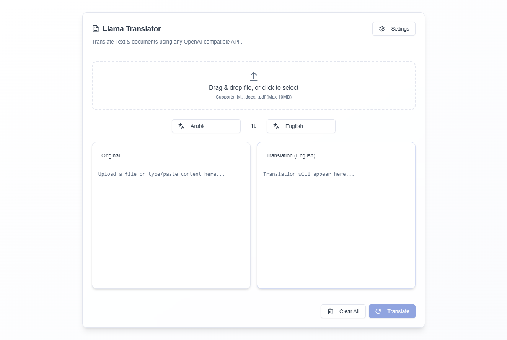
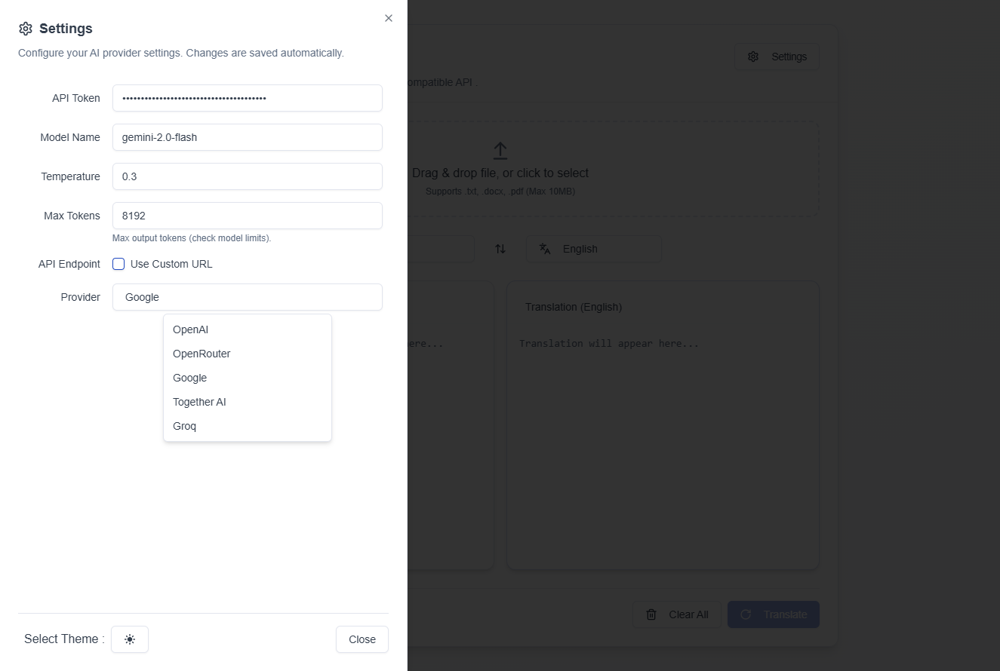

# 🦙 Llama Translator

A modern translation application powered by  large language models.

## 🌟 Features

- Fast and accurate text translation between multiple languages
- Supports Any LLM with OpenAI Compatible API .
- Can be used Offline with local  models
- User-friendly interface with responsive design
- Document translation support (PDF, DOCX,Txt, etc.)

## 🚀 Getting Started

### Prerequisites

- Node.js 
- package manager(npm ,pnpm, yarn...)
- LLM API key (if using an external LLM service)

### Installation

1. Clone this repository:
   ```bash
   git clone https://github.com/yourusername/llama-translator.git
   cd llama-translator
   ```

2. Install dependencies:
   ```bash
   npm install
   # or
   yarn install
   ```

3. Start the development server:
   ```bash
   npm run dev
   # or
   yarn dev
   ```

6. Open [http://localhost:3000](http://localhost:3000) in your browser.

## 💻 Usage

1. Select source and target languages from the dropdown menus
2. Enter or paste the text you want to translate
3. Click "Translate" button or press Enter
4. View your translated text 


## 📊 Project Status

This project is currently in active development. Feedback and contributions are welcome!

## Screenshots

